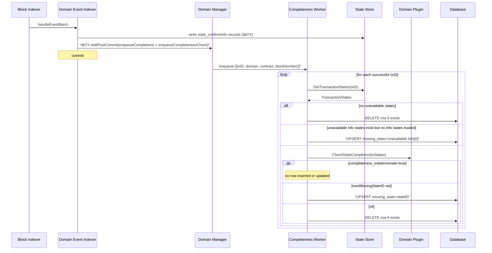
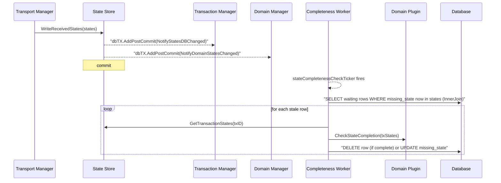
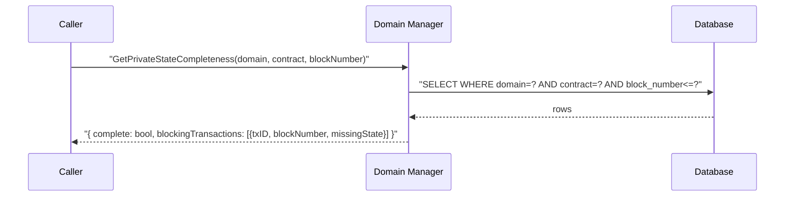
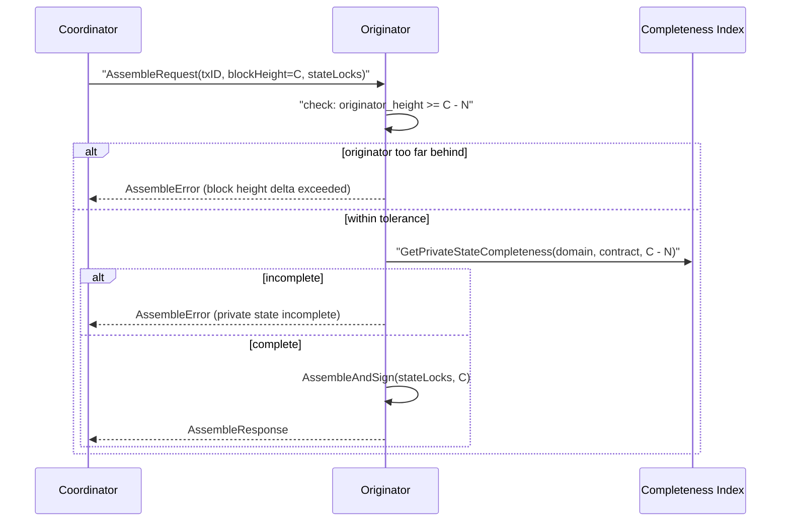

# Private State Completeness Index

## Problem

Private state distribution and on-chain transaction confirmation are independent processes. A transaction can be confirmed at block N while the private state payloads (coin states, lock states, info states) are still in transit from the coordinating node. There is currently no way for a node to answer:

> *"Have I received all the private state data I am entitled to for every transaction confirmed up to block N?"*

This question is a prerequisite for knowing whether a node is in a position to correctly assemble new transactions. A node that is missing private states it should have may produce inconsistent results when assembling against an incomplete view of the ledger.

---

## Design Goals

- Provide a queryable index: `GetPrivateStateCompleteness(domain, contract, blockNumber)` returning whether the node is complete and, if not, which transactions are still waiting and for which state.
- Core infrastructure must not decode domain state payloads or reason about domain-specific entitlement rules (which participants are entitled to which states). Those decisions are delegated to the domain plugin. Core observes only generic state categories (`Info`, `Coin`, `Data`, `Unavailable`) that are present for all domains, without interpreting their content.
- The answer must be **incremental**: computed once per transaction at confirmation time and updated as private states arrive, not recomputed on demand across all history.
- The index only covers successful confirmed transactions. Failed transactions do not produce private states that participants need to receive.

---

## Domain-Agnostic Design via `CheckStateCompletion`

`CheckStateCompletion` accepts a `TransactionStates` value (the output of `GetTransactionStates`) and returns either a missing state ID or nil. Because it takes the current snapshot of available and unavailable states as input and returns only a state ID, core can call it without understanding the domain's internal model. The domain plugin answers based on its own entitlement logic. This is the same mechanism already used by receipt listener gap detection, so it has existing implementations across all domains.

For any confirmed transaction, core:

1. Calls `stateManager.GetTransactionStates(txID)` to get the current picture: which states are present in the local store and which are referenced by the transaction but absent (unavailable).
2. If unavailable info states exist but no info states have been loaded yet, records the first unavailable info state as the blocker without calling the domain. Calling the domain at this point would be unproductive: all current domain implementations require their info states to evaluate entitlement (Noto reads the manifest from info states; Pente reads group configuration from info states). This short-circuit uses the same logic already present in `receipt_listeners.go` and avoids a redundant cross-process plugin call.
3. Otherwise calls `domain.CheckStateCompletion(txStates)` and persists the result.

### The `INDETERMINATE` Problem

Not all domains can determine which missing states a node is entitled to. For domains without entitlement metadata (Noto V0 has no manifest; Zeto has no equivalent), the existing `CheckStateCompletion` behaviour returns `FirstUnavailableId` regardless of whether the node has any entitlement to that state. This is incorrect for the completeness index: on a Noto V0 transfer from Alice to Bob, Alice's change coin appears in Bob's `state_confirm_records` (written by the event indexer from the on-chain `outputs[]` array) but was never distributed to Bob. Bob's node would be permanently marked as waiting for a state that will never arrive.

A new `completeness_indeterminate` boolean field is added to `CheckStateCompletionResponse`. When set, the completeness worker does not insert or update any row for that transaction. Because the table contains only waiting rows, the transaction's absence means the block-height query does not count it — the same outcome as if it were explicitly excluded. The receipt listener call site receives the new return value but ignores it, preserving existing behaviour.

| Domain | `CheckStateCompletion` result | Effect on index |
|---|---|---|
| Noto V1 (manifest present) | `COMPLETE` or `WAITING_FOR <stateID>` | Row deleted (complete) or upserted with `missing_state` |
| Noto V0 | `INDETERMINATE` | No row written; transaction absent from index |
| Noto V1, info states unavailable | Fast-path: `WAITING_FOR Unavailable.Info[0]` (domain not called) | Row upserted with `missing_state=Unavailable.Info[0]` |
| Zeto | `INDETERMINATE` | No row written; transaction absent from index |
| Pente | `COMPLETE` or `WAITING_FOR <stateID>` | Row deleted (complete) or upserted with `missing_state` |

A node with contracts that always return `INDETERMINATE` (Noto V0, Zeto) will have no rows in the table for those contracts. The completeness query returns 0 waiting rows, which is correct: the index makes no claim about those transactions, and the domain itself cannot make one either.

---

## Ownership: Domain Manager

The completeness index lives in the **domain manager** (`core/go/internal/domainmgr/`).

The natural trigger point is the domain event indexer (`event_indexer.go`), which already lives in domainmgr. When it processes a confirmed block it writes all state records (`state_confirm_records`, `state_info_records`) into the current database transaction, calls `FinalizeTransactions`, and post-commit enqueues completions to the sequencer. `TxCompletion.OnChain.BlockNumber`, domain name, and contract address are all available at that point without reaching into another component. Enqueueing the completeness check post-commit alongside the existing enqueue is a single additional line.

`FinalizeTransactions` is called from five places covering both successes and failures. The event indexer is specifically the on-chain success path for domain transactions, which is the only path the completeness index needs. Triggering from there avoids adding filtering logic inside `FinalizeTransactions` to distinguish the call sites.

The primary consumer of the completeness result will be transaction assembly gating. Assembly is performed via `DomainSmartContract`, which already lives in the domain manager. Keeping the index co-located avoids introducing a new dependency from the sequencer into the transaction manager.

---

## Index Schema

The table stores only outstanding work: a row exists for a transaction only while it is waiting for a specific missing state. When the missing state arrives (or the transaction is found to have no unavailable states), the row is deleted. This keeps the table bounded to the number of currently-blocked transactions regardless of how long the node has been running, mirroring the design of `receipt_listener_gap` which also deletes rows on resolution.

Transactions for which the domain returns `INDETERMINATE` are simply not inserted. They are excluded from the completeness query by their absence rather than by a filter, and there is no mechanism that would cause a re-evaluation to a different outcome for those transactions. On restart the event indexer replays only missed blocks; it does not re-enqueue transactions from already-processed blocks, so previously-skipped `INDETERMINATE` transactions remain absent and the query correctly returns 0 waiting rows for them.

On restart, any rows still in the table represent transactions confirmed before the shutdown that were blocked on a state not yet delivered by the transport layer at the time of shutdown. They persist so that when the transport layer delivers those states after restart, the worker can re-evaluate the affected rows.

```
private_state_completeness
  domain        TEXT      -- domain name
  contract      TEXT      -- contract address
  transaction   TEXT      -- Paladin transaction UUID (FK to transaction_receipts)
  block_number  BIGINT    -- block number from TxCompletion.OnChain.BlockNumber
  missing_state TEXT      -- the state ID this transaction is blocked on
  checked_at    BIGINT    -- unix nanosecond timestamp of last evaluation

PRIMARY KEY (domain, contract, transaction)
INDEX (domain, contract, block_number)   -- for block-height queries
INDEX (missing_state)                    -- for state-arrival re-evaluation
INDEX (checked_at)                       -- for stale-waiting periodic sweep
```

Every row in the table represents a transaction that is currently waiting. There is no `status` column because the presence of a row is itself the status. The block-height completeness query:

```sql
SELECT COUNT(*) FROM private_state_completeness
WHERE domain = ? AND contract = ? AND block_number <= ?
```

Returns 0 if the node is complete up to that height. Each row that exists indicates a specific transaction and state ID still outstanding.

---

## Architecture

### Write Path 1: Transaction Confirmation



### Write Path 2: State Arrival

When private states arrive via reliable message delivery, the state manager calls a new `NotifyDomainStatesChanged` on the domain manager interface alongside the existing `txManager.NotifyStatesDBChanged` call. Adding this second notification avoids polling latency without introducing a new component dependency — the state manager already holds a domain manager reference (used for `GetDomainByName` in `WriteReceivedStates`). The notification wakes the completeness worker's ticker. The worker inner-joins the table against the `states` table on `missing_state = states.id` to find rows whose blocking state has now arrived, and re-evaluates each.



### Query Path



---

## Use by the Sequencer State Machines

### `blockHeightTolerance` (N)

A new configuration parameter `blockHeightTolerance` (N) already exists on the sequencer. It defines the maximum block height difference that is acceptable between an originator and a coordinator when coordinating a transaction, and governs two related mechanisms:

- State locks (the in-memory record of which states are locked by recently-confirmed transactions) are retained for N blocks after confirmation. The coordinator includes these locks in every `AssembleRequest` it sends to the originator, so the originator has a consistent picture of the recent state even if it has not yet indexed those blocks itself.
- The completeness index is queried at `coordinatorBlockHeight - N`. Because the coordinator's state locks cover the N-block window, the originator only needs its own private state store to be complete up to the point where the locks take over.

Together these two mechanisms mean the originator can assemble correctly as long as: (a) it is within N blocks of the coordinator, and (b) it has all private states up to `coordinatorBlockHeight - N`.

### Delegation

When an originator delegates a transaction to a coordinator, the `DelegationRequest` carries the originator's current block height (this field already exists in the proto). The coordinator checks:

```
coordinator_block_height - originator_block_height > N  →  reject delegation
```

If the originator is more than N blocks behind, its private state store is too stale for assembly to be reliable, and the coordinator rejects the delegation until the originator catches up.

### Assemble Request Handling (Originator)

When the originator's state machine receives an `AssembleRequest`, it performs two checks before proceeding to `AssembleAndSign`.

**Check 1 — block height delta:**

```
coordinator_block_height - originator_block_height > N  →  reject
```

This mirrors the delegation-time check. It is unlikely to trigger given the equivalent check at delegation, but it is possible if the originator falls behind after accepting delegation (e.g. a block is indexed by the coordinator between delegation and assembly). The originator sends an `AssembleError` response. The coordinator re-pools the transaction (`State_Pooled`), where it awaits re-selection. Each error increments `assembleErrorCount`; once that exceeds `assembleErrorRetryThreshold` the transaction is evicted from the coordinator (`State_Evicted`). When the originator catches up within block tolerance it can accept delegation again.

**Check 2 — private state completeness:**

```
GetPrivateStateCompleteness(domain, contract, coordinator_block_height - N) ≠ complete  →  reject
```

The originator calls the completeness index for the target block height `coordinator_block_height - N`. If any transactions in that range are still waiting for a state, the originator cannot reliably assemble: it may be missing private states that are not covered by the coordinator's state locks. The originator sends an `AssembleError` response. The coordinator re-pools the transaction as above, subject to the same `assembleErrorRetryThreshold` and eventual eviction. Each re-pool allows time for the missing state to arrive via the transport layer and the completeness index row to be deleted, but there is no guarantee the state will arrive before the threshold is exceeded.



### Why `C - N` is the Right Threshold

The coordinator's state locks span the window `[C-N, C]`: any transaction confirmed in that range has its state locks still held in memory and included in the `AssembleRequest`. For transactions confirmed before `C-N`, the coordinator has no in-memory locks — those states must already be in the originator's private state store. Querying the completeness index at `C-N` therefore checks exactly the gap that the state locks do not cover.

---

## Relationship to Receipt Listener Gaps

The receipt listener gap mechanism addresses a related but distinct problem: whether to deliver a receipt to a registered listener. Its gap and incomplete tables are per-listener, per-source, and delivery-sequence-aware. They are used as a filter on the receipt delivery page query to enforce ordered delivery per contract source.

The completeness index is global, per-transaction, and delivery-order-agnostic. It answers a single question about node readiness rather than gating a specific delivery stream.

Both mechanisms call `domain.CheckStateCompletion` and both re-evaluate when states arrive. The completeness index does not replace the receipt listener gap tables.

| | Receipt listener gaps | Completeness index |
|---|---|---|
| Owner | Transaction manager | Domain manager |
| Scope | Per-listener, per-contract source | Global, all confirmed transactions |
| Purpose | Gate ordered receipt delivery | Answer node readiness to assemble |
| Trigger | `FinalizeTransactions` → `notifyNewReceipts` | Event indexer post-commit |
| State arrival signal | `NotifyStatesDBChanged` on TXManager | `NotifyDomainStatesChanged` on DomainManager |
| Domain API | `CheckStateCompletion` | `CheckStateCompletion` (+ `INDETERMINATE`) |
| `INDETERMINATE` handling | Ignored (existing behaviour preserved) | No row inserted; transaction absent from index |
