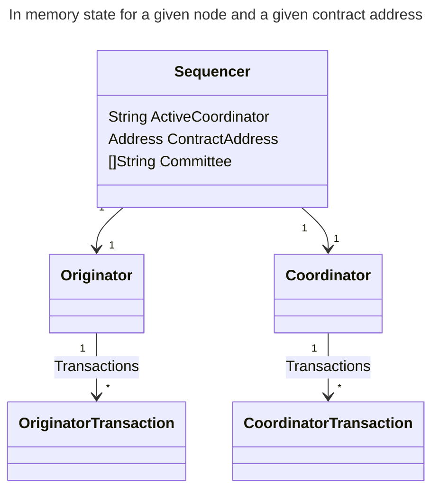

# Sequencer Components

In domains (such as Pente) where the spending rules for states allow any one of a group of parties to spend the state, then we need to coordinate the assembly of transactions across multiple nodes so that we can maximize the throughput by speculatively spending new states and avoiding transactions being reverted due to double concurrent spending / state contention.

To achieve this, it is important that we have an algorithm that allows all nodes to agree on which of them should be selected as the coordinator at any given point in time. And all other nodes delegate their transactions to the coordinator.

A node uses 3 key components to coordinate transactions with a domain contract:

### 1 - Sequencer

The sequencer manages the overall lifecycle of transactions submitted to the node. The sequencer comprises 2 sub-components:

### 2 - Originator

The originator is responsible for assembling and transactions when instructed to do so by the coordinator.

### 3 - Coordinator

The coordinator determines which contract-wide states should be spent in order to satisfy a transaction's inputs and communicates with originators to instruct them what to submit to the EVM.

A coordinator may not always be running on every node participating in the private contract (see below).

For each node, for each active private contract, there is one instance of the `Sequencer` in memory. The `Sequencer` contains sub components for the `Originator` and `Coordinator`. The `Originator` is responsible for keeping track of transactions sent, including delegating them to the active coordinator (which may be on a different node) and responding to requests to assemble its tranasctions. The `Coordinator` is responsible for coordinating the assembly and submission of transactions from all `Originators`.

## Sequencer lifecycle

Paladin runs a dedicated sequencer for every domain contract deployed to it. The sequencer used for different contracts have different committee members, different transaction histories, and different states.

Some contracts will single-use (or very infrequent use) where others may regularly have high transaction throughput. Paladin has to manage the lifecycle of every sequencer to avoid indefinite resource consumption within the runtime.

The seqencer lifecycle management built in to Paladin is highly configurable, but the default configuration is intended to provide:

- minimal resource consumption for infrequently used contracts
  - a sequencer will be removed from memory after a period of inactivity
- minimal latency for frequently used contracts
  - a sequencer will not be removed from memory if it receives regular transactions or contract calls, unless other sequencers have higher requirements
- stability of the Paladin runtime
