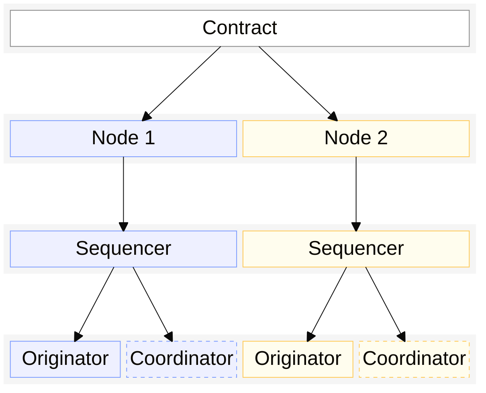
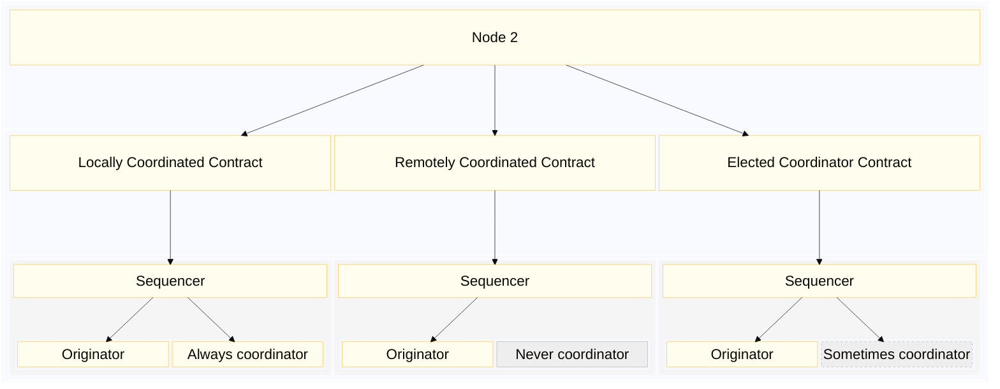

# Transaction coordination protocol

The coordination role varies depending on the type of domain. In some cases there are specific nodes in the network who coordinate all activity relating to a private transaction (for example Noto). In other cases the only node who can coordinate transactions is the originator of the transaction (for example Zeto).

Paladin domains use one of the following coordination models:

1. Always local
    - Always acts as coordinator for its own transactions relating to the contract, for example when participating in a Zeto token contract.
2. Always remote
    - Never acts as a coordinator for the private contract, for example when particpating in a Noto token but never acting as the notary for the token
3. Leader elected
    - May act as a coordinator based on the distributed coordination algorithm, for example when participating in a Pente private contract

The following diagram shows 3 different domain contracts that 2 nodes are participating in. For the 3 domain contracts the nodes play different coordination roles:

```mermaid
%%{init: {'theme': 'base', 'themeVariables': { 'fontSize': '40px', 'fill':'#33bb22'}}}%%
block-beta
      columns 1
      block:domaintokens
        columns 3
        domainContract1["Locally Coordinated Contract"]
        domainContract2["Remotely Coordinated Contract"]
        domainContract3["Elected Coordinator Contract"]
        space
        space
        space
      end
      block:domaincontracts
        columns 3
        block:lcnodes
          columns 1
          block:lcnodelist
            columns 2
            c1node1["Node 1"]
            c1node2["Node 2"]
            space
            space
          end
          block:lcsequencercomponents
            columns 2
            c1node1sequencer["Sequencer"]
            c1node2sequencer["Sequencer"]
            space
            space
            block:seq1componentlist
              block:seq1components
                c1node1originator["Originator"]
                c1node1coordinator["Coordinator"]
              end
            end
            block:seq2componentlist
              block:seq2components
                c1node2originator["Originator"]
                c1node2coordinator["Coordinator"]
              end
            end
          end
        end
        block:rcnodes
          columns 1
          block:rcnodelist
            columns 2
            c2node1["Node 1"]
            c2node2["Node 2"]
            space
            space
          end
          block:rcsequencercomponents
            columns 2
            c2node1sequencer["Sequencer"]
            c2node2sequencer["Sequencer"]
            space
            space
            block:seq3componentlist
              block:seq3components
                c2node1coordinator["Coordinator"]
              end
            end
            block:seq4componentlist
              block:seq4components
                c2node2originator["Originator"]
              end
            end
          end
        end
        block:elnodes
          columns 1
          block:elnodelist
            columns 2
            c3node1["Node 1"]
            c3node2["Node 2"]
            space
            space
          end
          block:elsequencercomponents
            columns 2
            c3node1sequencer["Sequencer"]
            c3node2sequencer["Sequencer"]
            space
            space
            block:seq5componentlist
              block:seq5components
                c3node1originator["Originator"]
                c3node1coordinator["Coordinator"]
              end
            end
            block:seq6componentlist
              block:seq6components
                c3node2originator["Originator"]
                c3node2coordinator["Coordinator"]
              end
            end
          end
        end
  end
  domainContract1 --> c1node1
  domainContract1 --> c1node2
  domainContract2 --> c2node1
  domainContract2 --> c2node2
  domainContract3 --> c3node1
  domainContract3 --> c3node2
  c1node1 --> c1node1sequencer
  c1node2 --> c1node2sequencer
  c2node1 --> c2node1sequencer
  c2node2 --> c2node2sequencer
  c3node1 --> c3node1sequencer
  c3node2 --> c3node2sequencer
  c1node1sequencer --> c1node1originator
  c1node2sequencer --> c1node2originator
  c1node1sequencer --> c1node1coordinator
  c1node2sequencer --> c1node2coordinator
  c2node1sequencer --> c2node1coordinator
  c2node2sequencer --> c2node2originator
  c3node1sequencer --> c3node1originator
  c3node1sequencer --> c3node1coordinator
  c3node2sequencer --> c3node2originator
  c3node2sequencer --> c3node2coordinator
  style domainContract1 fill:#ffffff,stroke:#999999
  style domainContract2 fill:#ffffff,stroke:#999999
  style domainContract3 fill:#ffffff,stroke:#999999
  style c1node1 fill:#eef0ff,stroke:#7e9dff
  style c1node2 fill:#fffdee,stroke:#ffca58
  style c2node1 fill:#eef0ff,stroke:#7e9dff
  style c2node2 fill:#fffdee,stroke:#ffca58
  style c3node1 fill:#eef0ff,stroke:#7e9dff
  style c3node2 fill:#fffdee,stroke:#ffca58
  style c1node1sequencer fill:#eef0ff,stroke:#7e9dff
  style c1node2sequencer fill:#fffdee,stroke:#ffca58
  style c2node1sequencer fill:#eef0ff,stroke:#7e9dff
  style c2node2sequencer fill:#fffdee,stroke:#ffca58
  style c3node1sequencer fill:#eef0ff,stroke:#7e9dff
  style c3node2sequencer fill:#fffdee,stroke:#ffca58
  style c1node1coordinator fill:#e8eeff,stroke:#a7bcff
  style c1node2coordinator fill:#fffdee,stroke:#ffca58
  style c2node1coordinator fill:#e8eeff,stroke:#a7bcff
  style c3node1coordinator fill:#e8eeff,stroke:#a7bcff
  style c3node2coordinator fill:#ffffff,stroke:#777777,stroke-dasharray: 5 5
  style c1node1originator fill:#e8eeff,stroke:#a7bcff
  style c1node2originator fill:#fffdee,stroke:#ffca58
  style c2node2originator fill:#fffdee,stroke:#ffca58
  style c3node1originator fill:#e8eeff,stroke:#a7bcff
  style c3node2originator fill:#fffdee,stroke:#ffca58
  style seq1components fill:#f5f5f5,stroke:#f5f5f5
  style seq2components fill:#f5f5f5,stroke:#f5f5f5
  style seq3components fill:#f5f5f5,stroke:#f5f5f5
  style seq4components fill:#f5f5f5,stroke:#f5f5f5
  style seq5components fill:#f5f5f5,stroke:#f5f5f5
  style seq6components fill:#f5f5f5,stroke:#f5f5f5
  style seq1componentlist fill:#f5f5f5,stroke:#f5f5f5
  style seq2componentlist fill:#f5f5f5,stroke:#f5f5f5
  style seq3componentlist fill:#f5f5f5,stroke:#f5f5f5
  style seq4componentlist fill:#f5f5f5,stroke:#f5f5f5
  style seq5componentlist fill:#f5f5f5,stroke:#f5f5f5
  style seq6componentlist fill:#f5f5f5,stroke:#f5f5f5
  style lcnodes fill:#f5f5f5,stroke:#f5f5f5
  style lcnodelist fill:#f5f5f5,stroke:#f5f5f5
  style lcsequencercomponents fill:#f5f5f5,stroke:#f5f5f5
  style elnodes fill:#f5f5f5,stroke:#f5f5f5
  style elnodelist fill:#f5f5f5,stroke:#f5f5f5
  style elsequencercomponents fill:#f5f5f5,stroke:#f5f5f5
  style rcnodes fill:#f5f5f5,stroke:#f5f5f5
  style rcnodelist fill:#f5f5f5,stroke:#f5f5f5
  style rcsequencercomponents fill:#f5f5f5,stroke:#f5f5f5
  style domaintokens fill:#f5f5f5,stroke:#f5f5f5
  style domaincontracts fill:#f5f5f5,stroke:#f5f5f5
```

In the example above the coordination is as follows:

- The locally coordinated contract requires every node to coordinate their own private transactions.
- The remotely coordinated contract is always coordinated by Node 1. Node 2 never acts as the coordinator.
  - In this example Node 1 isn't participating in the private contract itself, it is only acting as the coordinator. This is a common pattern for notarized contracts where coordination is performed by a separate group of nodes.
- The elected coordinator contract is coordinated by the currently elected leader. At any given time, either node may be the coordinator depending on the leadership election algorithm

Since a Paladin node may be participating in multiple private contracts in different Paladin domains, it may be running coordinators for some contracts but not running coordinators for others. If the node never acts as a coordinator for one of the private contracts its sequencer only serves to submit transactions based on instructions from the coordinator (running on another node).

The following diagram shows the components that are active in a node for 3 types of domain contract:

## Scope of the distributed sequencing algorithm

The distributed coordination algorithm described in the rest of this topic only applies to _Remotely Coordinated_ and _Leader Elected_ domains.

_Locally Coordinated_ domains always run a coordinator for every participating node. Nodes cannot coordinate other nodes' transactions, even if they are participating in the same private contract.

_Remotely Coordinated_ domains could be considered a sub-category of _Leader Elected_. In some cases there will be a single coordinator for all participating nodes. However, in other cases there may be a group of remote coordinators who could use leadership election to determine which coordinator is currently the active one. For this topic the distributed sequencing algorithm applies to _Remotely Coordinated_ domains where there is more than 1 possible coordinator for the contract.

## Objectives

The objective of this algorithm is to maximize efficiency (reduce probably for revert leading to retry cycles of valid request) and throughput (allow many transactions to be included in each block). This algorithm does not attempt to provide a guarantee on final data consistency but instead relies on the base ledger contract to do so (e.g. double spend protection, attestation validation, exactly once intent fulfillment).

The desired properties of that algorithm are

- **deterministic**: all nodes can run the algorithm and eventually agree on a single coordinator at any given point in time. This is a significant property because it means we don't want to rely on a message-based leader election process like in some algorithms such as Raft. This reduces the overhead of message exchanges among the nodes
- **fair**: the algorithm results in each node being selected as coordinator for a proportional number of times over a long enough time frame
- **fault tolerant**: Although pente already depends on all nodes being available (because of the 100% endorsement model) the desired algorithm should be future proof and be compatible with <100% endorsement model where network faults and down time of a minority of nodes can bee tolerated.

## Summary

The 3 basic premises of the algorithm are:

1. Once a coordinator has been elected, it is possible for it to continue indefinitely as the coordinator
    - This is an intentional design choice, intended to provide optimal throughput for a contract
2. If an elected coordinator fails, another coordinator will take over the role
    - This ensures high availability of the private contract
3. The choice of coordinator is deterministic based on block number and liveness of the existing coordinator
    - The deterministic choice of coordinator only needs to take place if the existing coordinator becomes unavailable

Full rules for the the algorithm:

- Ranking of the preference for coordinator selection for any given contract address, for any given point in time ( block height) is a deterministic function that all nodes will agree on given the same awareness of make up of committee
- Composition of committee i.e. the set of nodes who are candidates for coordinator is universally agreed (similar to BFT algorithms).
- Liveness of the coordinator node can be detected via heartbeat messages.
- Coordinators will keep going until they are told otherwise (e.g. by a handover request from another coordinator) or there is a sufficient lul in activity that it naturally flushes
    - if that means the coordinator goes on forever, then so be it
    - originators keep delegating to the current active coordinator and only choose a new one if that coordinator stops sending heartbeats.
    - originators remember which coordinators have been detected as unresponsive recently and go through the list in order
    - this means that if originator A fails over (or swaps out / in) while originator B is still online, then originator A may delegate to a different coordinator and trigger a handover. So be it.
- The originator node for each transaction is responsible for ensuring that the transaction always has one coordinator actively coordinating it by detecting and responding to situations where the transaction is not being coordinated
- Situations can arise where different nodes chose different coordinators because of different awareness of block height and/or different awareness of availability. The algorithm is less efficient when this happens but continues to function and can return to full efficiency as soon as the situation is resolved.
- There is no need for election `term`s in this algorithm.
- When coordinator responsibility is switched to another node, each inflight transaction is either re-assigned to the new coordinator or flushed through to confirmation on the base ledger
    - If the originator deems the transaction to be no longer valid, it is responsible for finalizing it as reverted.
    - If the originator deems the transaction not ready to be submitted, it is responsible for parking it until it is ready.
    - If a transaction is successfully assembled and endorsed but subsequently reverted on the base ledger contract, the coordinator is is responsible for retrying at a frequency that does not cause excessive load on the system.
- The originator node continues to monitor and control the delegation of its transaction until it has received receipt of the transactions' confirmations on the base ledger. This provides an "at least once" quality of service for every transaction at the distributed sequencer layer. As described earlier the blockchain enforces "at most once" semantics, so there is no possibility of duplicate transactions.
- The handshake between the originator node and the coordinator node(s) attempts to minimize the likelihood of the same transaction intent resulting in 2 valid base ledger transactions but cannot eliminate that possibility completely so there is protection against duplicate intent fulfillment in the base ledger contract
