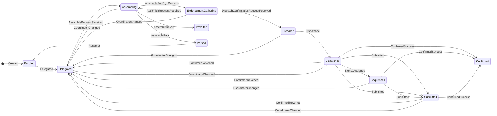
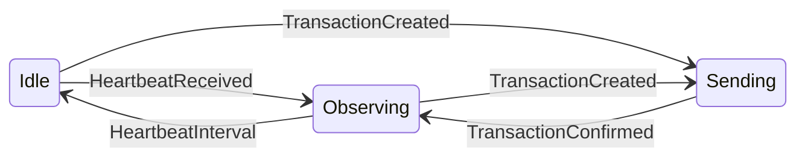
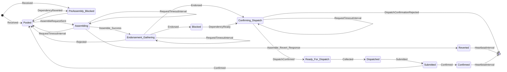
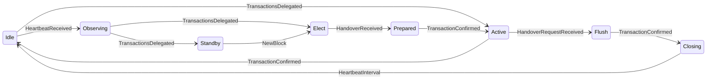

# Sequencer and transaction state machines

The distributed sequencer is designed as a set of state machines, each of which manages the state of the sequencer components (originator and coordinator) and of sequencer transactions (at the originator and at the coordinator).

For the transaction state machines metrics show how long transactions spend in each state.

#### Originator transaction's state

The states that a transaction goes through, from the perspective of the transaction originator are:

- Initial: Initial state before anything is calculated
- Pending: Intent for the transaction has been created in the database and has been assigned a unique ID but is not currently known to be being processed by a coordinator
- Delegated: the transaction has been sent to the current active coordinator
- Assembling: the coordinator has sent an assemble request that we have not replied to yet
- EndorsementGathering: e have responded to an assemble request and are waiting the coordinator to gather endorsements and send us a dispatch confirmation request
- Signing: we have assembled the transaction and are waiting for the signing module to sign it before we respond to the coordinator with the signed assembled transaction
- Prepared: we know that the coordinator has got as far as preparing a public transaction and we have sent a positive response to a coordinator's dispatch confirmation request but have not yet received a heartbeat that notifies us that the coordinator has dispatched the transaction to a public transaction manager for submission
- Dispatched: the active coordinator that this transaction was delegated to has dispatched the transaction to a public transaction manager for submission
- Sequenced: the transaction has been assigned a nonce by the public transaction manager
- Submitted: the transaction has been submitted to the blockchain
- Confirmed: the public transaction has been confirmed by the blockchain as successful
- Reverted: upon attempting to assemble the transaction, the domain code has determined that the intent is not valid and the transaction is finalized as reverted
- Parked: upon attempting to assemble the transaction, the domain code has determined that the transaction is not ready to be assembled and it is parked for later processing. All remaining transactions for the current originator can continue - unless they have an explicit dependency on this transaction

Events that can cause a transition between states and/or trigger an action when the transaction is in a given state are:

- Created: Transaction initially received by the originator or has been loaded from the database after a restart / swap-in
- ConfirmedSuccess: Confirmation received from the blockchain of base ledge transaction successful completion
- ConfirmedReverted: Confirmation received from the blockchain of base ledge transaction failure
- Delegated: Transaction has been delegated to a coordinator
- AssembleRequestReceived: Coordinator has requested that we assemble the transaction
- AssembleAndSignSuccess: We have successfully assembled the transaction and signing module has signed the assembled transaction
- AssembleRevert: We have failed to assemble the transaction
- AssemblePark: We have parked the transaction
- AssembleError: An unexpected error occurred while trying to assemble the transaction
- Dispatched: Coordinator has dispatched the transaction to a public transaction manager
- DispatchConfirmationRequestReceived: Coordinator has requested confirmation that the transaction has been dispatched
- Resumed: Received an RPC call to resume a parked transaction
- NonceAssigned: The public transaction manager has assigned a nonce to the transaction
- Submitted: The transaction has been submitted to the blockchain
- CoordinatorChanged: The coordinator has changed

#### Originator's state

The states that a originator goes through:

- Idle: Not acting as a originator and not aware of any active coordinators
- Observing: Not acting as a originator but aware of a node (which may be the same node) acting as a coordinator
- Sending: Has some transactions that have been sent to a coordinator but not yet confirmed TODO should this be named State_Monitoring or State_Delegated or even State_Sent. Sending sounds like it is in the process of sending the request message.

Events that can cause a transition between states and/or trigger an action when the originator is in a given state are:

- HeartbeatInterval: The heartbeat interval has passed since the last time a heartbeat was received or the last time this event was received
- HeartbeatReceived: A heartbeat message was received from the current active coordinator
- TransactionCreated: A new transaction has been created and is ready to be sent to the coordinator
- TransactionConfirmed: A transaction, that was send by this originator, has been confirmed on the base ledger
- NewBlock: A new block has been mined on the base ledger
- Base_Ledger_Transaction_Reverted: a transaction has moved from the dispatched to pending state because it was reverted on the base ledger

#### Coordinators transaction state

The states that a transaction goes through, from the perspective of the transaction coordinator are:

- Pooled: Waiting in the pool to be assembled - TODO should rename to "Selectable" or "Selectable_Pooled". Related to potential rename of `State_PreAssembly_Blocked`
- PreAssembly_Blocked: Has not been assembled yet and cannot be assembled because a dependency never got assembled successfully - i.e. it was either Parked or Reverted is also blocked
- Assembling: An assemble request has been sent but we are waiting for the response
- Reverted: The transaction has been reverted by the assembler/originator
- Endorsement_Gathering: Assembled and waiting for endorsement
- Blocked: Is fully endorsed but cannot proceed due to dependencies not being ready for dispatch
- Confirming_Dispatch: Endorsed and waiting for dispatch confirmation
- Ready_For_Dispatch: Dispatch confirmation received and waiting to be collected by the dispatcher thread. Going into this state is the point of no return
- Dispatched: Collected by the dispatcher thread but not yet submitted
- Submitted: At least one submission has been made to the blockchain
- Confirmed: Recently confirmed on the base ledger. NOTE: confirmed transactions are not held in memory for ever so getting a list of confirmed transactions will only return those confirmed recently
- Final: Final state for the transaction. Transactions are removed from memory as soon as they enter this state

Events that can cause a transition between states and/or trigger an action when the transaction is in a given state are:

- Received: Transaction initially received by the coordinator. Might seem redundant explicitly modeling this as an event rather than putting this logic into the constructor, but it is useful to make the initial state transition rules explicit in the state machine definitions
- Selected: Selected from the pool as the next transaction to be assembled
- AssembleRequestSent: Assemble request sent to the assembler
- Assemble_Success: Assemble response received from the originator
- Assemble_Revert_Response: Assemble response received from the originator with a revert reason
- Endorsed: Endorsement received from one endorser
- EndorsedRejected: Endorsement received from one endorser with a revert reason
- DependencyReady: Another transaction, for which this transaction has a dependency on, has become ready for dispatch
- DependencyAssembled: Another transaction, for which this transaction has a dependency on, has been assembled
- DependencyReverted: Another transaction, for which this transaction has a dependency on, has been reverted
- DispatchConfirmed: Dispatch confirmation received from the originator
- DispatchConfirmationRejected: Dispatch confirmation response received from the originator with a rejection
- Collected: Collected by the dispatcher thread
- NonceAllocated: Nonce allocated by the dispatcher thread
- Submitted: Submission made to the blockchain. Each time this event is received, the submission hash is updated
- Confirmed: Confirmation received from the blockchain of either a successful or reverted transaction
- RequestTimeoutInterval: Event emitted by the state machine on a regular period while we have pending requests
- StateTransition: Event emitted by the state machine when a state transition occurs. TODO should this be a separate enum?
- AssembleTimeout: The assemble timeout period has passed since we sent the first assemble request

#### Coordinators state

The states that a coordinator goes through:

- Idle: Not acting as a coordinator and not aware of any other active coordinators
- Observing: Not acting as a coordinator but aware of another node acting as a coordinator
- Elect: Elected to take over from another coordinator and waiting for handover information
- Standby: Going to be coordinator on the next block range but local indexer is not at that block yet.
- Prepared: Have received the handover response but haven't seen the flush point confirmed
- Active: Have seen the flush point or have reason to believe the old coordinator has become unavailable and am now assembling transactions based on available knowledge of the state of the base ledger and submitting transactions to the base ledger.
- Flush: Stopped assembling and dispatching transactions but continue to submit transactions that are already dispatched
- Closing: Have flushed and am continuing to sent closing status for `x` heartbeats

Events that can cause a transition between states and/or trigger an action when the coordinator is in a given state are:

- TransactionsDelegated
- TransactionConfirmed
- TransactionDispatchConfirmed
- HeartbeatReceived
- NewBlock
- HandoverRequestReceived
- HandoverReceived
- TransactionStateTransition

