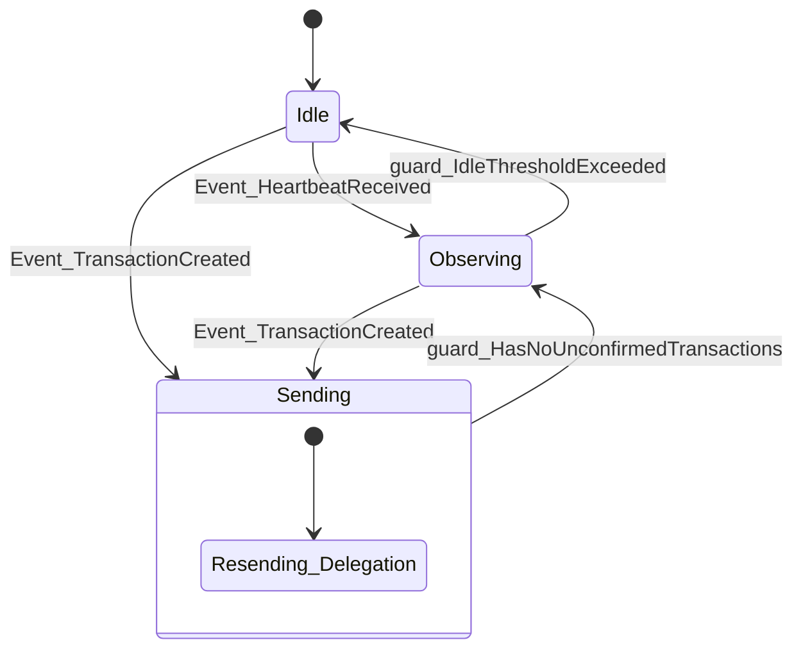
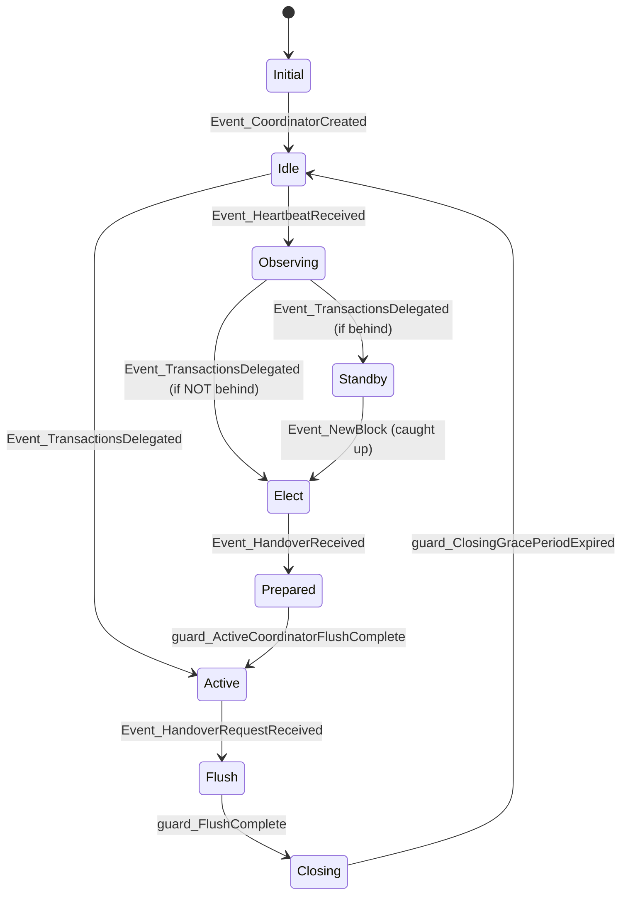
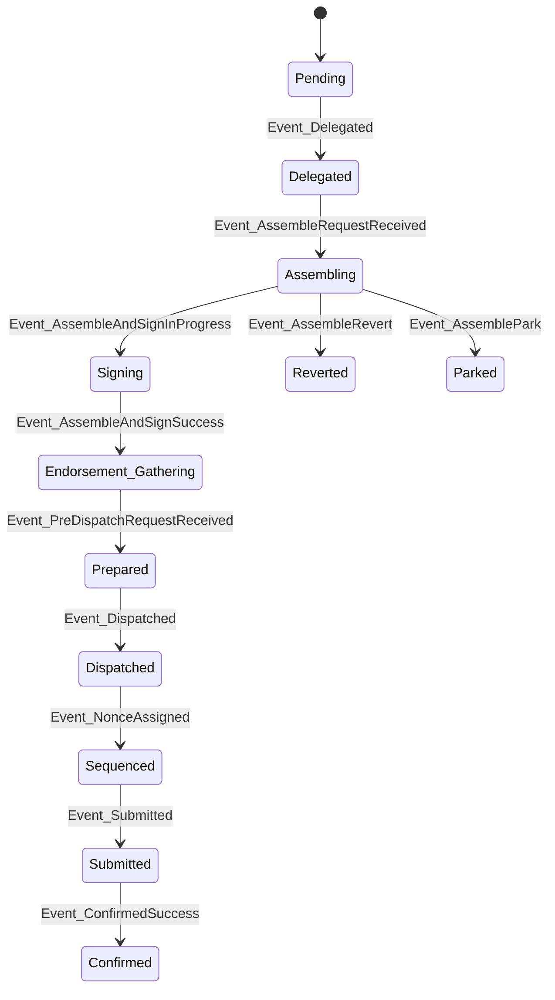
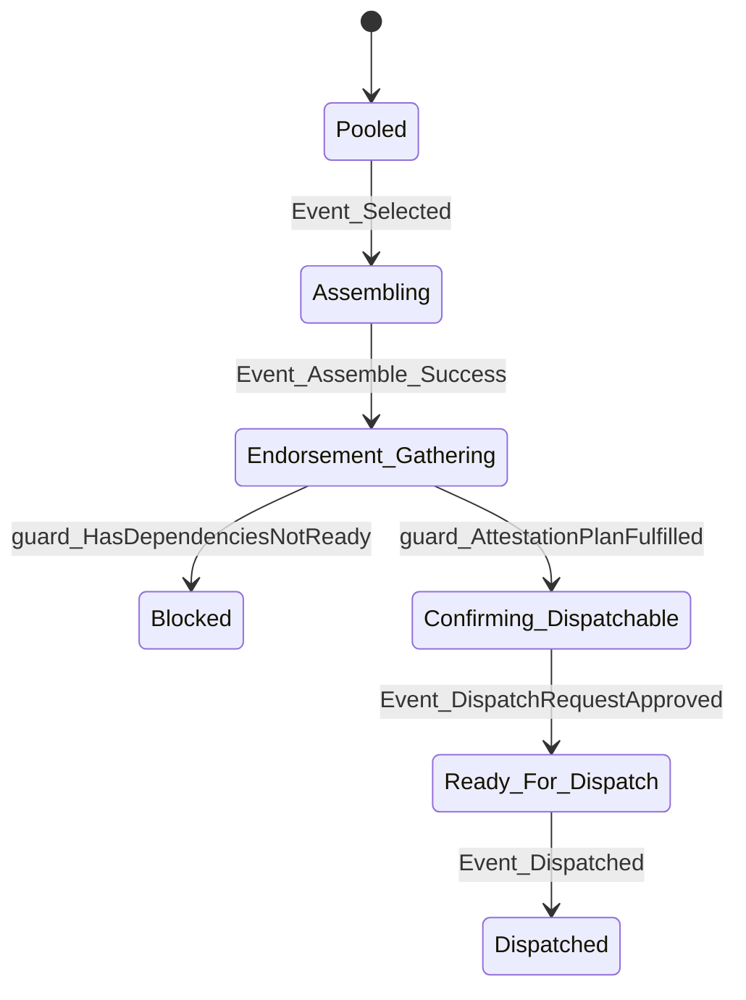

# Distributed Sequencer State Machines

Paladin's Distributed Sequencer is built on a foundation of hierarchical state machines. These state machines ensure that transaction sequencing is deterministic, idempotent, and resilient to node failures in a decentralized environment.

The system is composed of four distinct types of state machines, categorized by **Responsibility** (Node vs. Transaction) and **Role** (Originator vs. Coordinator).

| Role | Node-Level Responsibility | Transaction-Level Responsibility |
| :--- | :--- | :--- |
| **Originator** | Manages the node's intent to send transactions and tracks the active coordinator. | Manages the assembly, signing, and submission lifecycle of a specific transaction. |
| **Coordinator** | Manages leader election, active sequencing duty, and handover protocols. | Manages the polling, endorsement, and dispatching of transactions into blocks. |

---

## 1. Originator Node State Machine

The Originator Node state machine tracks whether the local Paladin node is currently sending transactions or simply observing the network to identify the active coordinator.

### State Transition Diagram

```mermaid
stateDiagram-v2
    [*] --> Idle
    Idle --> Observing : Event_HeartbeatReceived
    Idle --> Sending : Event_TransactionCreated
    Observing --> Idle : guard_IdleThresholdExceeded
    Observing --> Sending : Event_TransactionCreated
    Sending --> Observing : guard_HasNoUnconfirmedTransactions
    
    state Sending {
        [*] --> Resending_Delegation
    }
```

### State Definitions

| State | Code Identifier | Description | Trigger / Condition |
| :--- | :--- | :--- | :--- |
| **Idle** | `State_Idle` | Not acting as an originator and not aware of any active coordinators. | Default initial state or after heartbeat timeout. |
| **Observing** | `State_Observing` | Not acting as an originator but aware of another node acting as a coordinator. | Receipt of a `Heartbeat` from an active coordinator. |
| **Sending** | `State_Sending` | Active transactions exist that have been sent/delegated to a coordinator. | New transaction created or pending transactions need delegation. |
| **Resending Delegation** | `State_Resending_Delegation` | Retrying delegation to the coordinator after a timeout or upon receiving a new heartbeat. | Node has "dropped" transactions that the coordinator isn't processing. |

### Technical Guide
- **Location**: `core/go/internal/sequencer/originator/state_machine.go`
- **Coordination**: Reliant on `Event_HeartbeatReceived`. If heartbeats stop for a duration exceeding `IdleThreshold`, the node reverts to `Idle` to trigger a new leader search.

---

## 2. Coordinator Node State Machine

The Coordinator Node state machine manages the "leadership" lifecycle and handover between nodes.

### State Transition Diagram

```mermaid
stateDiagram-v2
    [*] --> Initial
    Initial --> Idle : Event_CoordinatorCreated
    Idle --> Active : Event_TransactionsDelegated
    Idle --> Observing : Event_HeartbeatReceived
    Observing --> Elect : Event_TransactionsDelegated (if NOT behind)
    Observing --> Standby : Event_TransactionsDelegated (if behind)
    Standby --> Elect : Event_NewBlock (caught up)
    Elect --> Prepared : Event_HandoverReceived
    Prepared --> Active : guard_ActiveCoordinatorFlushComplete
    Active --> Flush : Event_HandoverRequestReceived
    Flush --> Closing : guard_FlushComplete
    Closing --> Idle : guard_ClosingGracePeriodExpired
```

### State Definitions

| State | Code Identifier | Description | Trigger / Condition |
| :--- | :--- | :--- | :--- |
| **Initial** | `State_Initial` | Coordinator created; awaiting active selection. | Component startup. |
| **Idle** | `State_Idle` | Not coordinating; no known active leaders. | Default quiescent state. |
| **Observing** | `State_Observing` | Following another active coordinator via heartbeats. | Heartbeat received from another node. |
| **Standby** | `State_Standby` | Node is trailing the active coordinator's block height and cannot yet take over. | Delegated transactions received while the node is **behind**. |
| **Elect** | `State_Elect` | Elected to take over; requesting handover information from the previous leader. | Node is in sync and receives delegated transactions. |
| **Active** | `State_Active` | Actively sequencing transactions and broadcasting heartbeats. | Successful handover or elected from `Idle`. |
| **Flush** | `State_Flush` | Leadership handover in progress; finishing existing in-flight transactions. | Handover request received from a new leader candidate. |
| **Closing** | `State_Closing` | Post-flush grace period before releasing leadership entirely. | All flushed transactions resolved. |

### Guard Metrics: What does "Behind" mean?
The `guard_Behind` condition determines if a node is eligible to transition from `Observing` to `Elect`.
- **Metric**: `indexerBlockHeight < activeCoordinatorBlockHeight - threshold`
- **Logic**: If the local node's block indexer is trailing the active coordinator's reported height by more than the configured `blockHeightTolerance`, it enters `Standby` until the `Event_NewBlock` signal confirms it has caught up.

---

## 3. Originator Transaction State Machine

Tracks a specific transaction's lifecycle from the sender's side.

### State Transition Diagram

```mermaid
stateDiagram-v2
    [*] --> Pending
    Pending --> Delegated : Event_Delegated
    Delegated --> Assembling : Event_AssembleRequestReceived
    Assembling --> Signing : Event_AssembleAndSignInProgress
    Signing --> Endorsement_Gathering : Event_AssembleAndSignSuccess
    Assembling --> Reverted : Event_AssembleRevert
    Assembling --> Parked : Event_AssemblePark
    Endorsement_Gathering --> Prepared : Event_PreDispatchRequestReceived
    Prepared --> Dispatched : Event_Dispatched
    Dispatched --> Sequenced : Event_NonceAssigned
    Sequenced --> Submitted : Event_Submitted
    Submitted --> Confirmed : Event_ConfirmedSuccess
```

### State Definitions

| State | Code Identifier | Description |
| :--- | :--- | :--- |
| **Pending** | `State_Pending` | Intent created; assigned a unique ID but not yet known by a coordinator. |
| **Delegated** | `State_Delegated` | Sent to the active coordinator; awaiting further instructions. |
| **Assembling** | `State_Assembling` | Originator is executing domain logic and resolving state reads. |
| **Signing** | `State_Signing` | Waiting for the signing module (e.g., HDWallet, Vault) to sign the payload. |
| **Endorsement Gathering** | `State_Endorsement_Gathering` | Assembled payload sent back; coordinator is now collecting endorser signatures. |
| **Prepared** | `State_Prepared` | Coordinator has prepared the public TX; originator has confirmed dispatch. |
| **Dispatched** | `State_Dispatched` | Transaction handed off to the public transaction manager for submission. |
| **Confirmed** | `State_Confirmed` | Success verified on the base ledger (blockchain). |

---

## 4. Coordinator Transaction State Machine

Manages the transaction while pooled and sequenced by the leader.

### State Transition Diagram

```mermaid
stateDiagram-v2
    [*] --> Pooled
    Pooled --> Assembling : Event_Selected
    Assembling --> Endorsement_Gathering : Event_Assemble_Success
    Endorsement_Gathering --> Blocked : guard_HasDependenciesNotReady
    Endorsement_Gathering --> Confirming_Dispatchable : guard_AttestationPlanFulfilled
    Confirming_Dispatchable --> Ready_For_Dispatch : Event_DispatchRequestApproved
    Ready_For_Dispatch --> Dispatched : Event_Dispatched
```

### State Definitions

| State | Code Identifier | Description |
| :--- | :--- | :--- |
| **Pooled** | `State_Pooled` | Transaction is in the memory pool, waiting for selection. |
| **Blocked** | `State_Blocked` | Endorsed but cannot proceed because a **chained dependency** is not yet ready for dispatch. |
| **Confirming Dispatchable** | `State_Confirming_Dispatchable` | Endorsed; coordinator is asking the originator if it's still OK to proceed. |
| **Ready for Dispatch** | `State_Ready_For_Dispatch` | Point of no return; transaction is queued for submission to the base ledger. |
| **Evicted** | `State_Evicted` | Removed from memory due to multiple assembly failures or timeouts. |

---

## 5. Troubleshooting Guide

### Common Stuck Scenarios

1. **Stuck in `Delegated`**
   - **Diagnosis**: Node cannot find an active coordinator or permissions are misconfigured.
   - **Check**: Run `paladin rpc sequencer_nodeStatus`. Ensure `activeCoordinator` is populated and reachable.

2. **Stuck in `Assembling`**
   - **Diagnosis**: Domain logic is failing or remote state is unavailable.
   - **Check**: Review `core` logs for `error assembling transaction`. Often caused by missing state inputs or logic reverts.

3. **Stuck in `Signing`**
   - **Diagnosis**: Signing module is unresponsive or the specified signing key is missing.
   - **Check**: Verify transport connectivity to the `signing-module`.

4. **Stuck in `Endorsement_Gathering`**
   - **Diagnosis**: Configured endorsers are offline or rejecting the transaction payload.
   - **Check**: Check `coordinator` logs for `endorsement rejected` or `timeout gathering endorsements`.

5. **Stuck in `Blocked`**
   - **Diagnosis**: A "Chained Dependency" (a previous transaction in a sequence) has parked or failed.
   - **Check**: Identify the transaction this one depends on via `tx_status` and resolve the root cause of the earlier failure.

6. **Multiple Active Coordinators (Split Brain)**
   - **Diagnosis**: Network partition causing two nodes to believe they are the leader.
   - **Check**: Monitor heartbeats. The base ledger's double-intent protection will eventually resolve this by reverting one set of transactions.

---

## 7. Developer Implementation Notes

### Modifying State Machines Safely
1. **Define the State**: Add the state to the `State` enum in the relevant `state_machine.go` file.
2. **Update Stringification**: Add the state to the `String()` receiver method for log readability.
3. **Define Transitions**: Update the `stateDefinitionsMap` with new `Events` and `Transitions`.
4. **Implement Guards/Actions**: Add corresponding `guard_` or `action_` functions in the same package.

### Testing Guidelines
- **Unit Tests**: Most state machines have a corresponding `state_machine_test.go`. Use the `statemachine.NewTestStateMachine` utility to simulate event sequences.
- **Component Tests**: Use `core/go/noderuntests` to verify end-to-end transaction flows between virtual nodes.
- **Trace Logs**: Set `LOG_LEVEL=trace` to see every event being processed by the `StateMachineEventLoop`.

---

*Location: `core/go/internal/sequencer/statemachine/statemachine.go`*
