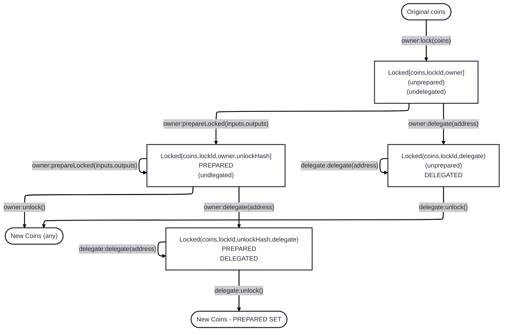

# Noto

Go domain that provides confidential notarized tokens controlled by a trusted party.

Please see https://LFDT-Paladin.github.io/paladin/head/architecture/noto/

## Locking model

```mermaid
---
config:
  theme: redux
  layout: elk
---
flowchart TB
    A(["Original coins"]) -- owner:lock(coins) --> B["Locked[coins,lockId,owner]
(unprepared)
(undelegated)"]
    B -- owner:prepareLocked(inputs,outputs) --> C["Locked[coins,lockId,owner,unlockHash]
PREPARED
(undlegated)"]
    C -- owner:prepareLocked(inputs,outputs) --> C
    C -- owner:unlock() --> X(["New Coins (any)"])
    C -- owner:delegate(address) --> D["Locked(coins,lockId,unlockHash,delegate)
PREPARED
DELEGATED"]
    B -- owner:delegate(address) --> E["Locked(coins,lockId,delegate)
(unprepared)
DELEGATED"]
    D -- delegate:delegate(address) --> D
    D -- delegate:unlock() --> Y(["New Coins - PREPARED SET"])
    E -- delegate:delegate(address) --> E
    E -- delegate:unlock() --> X
```